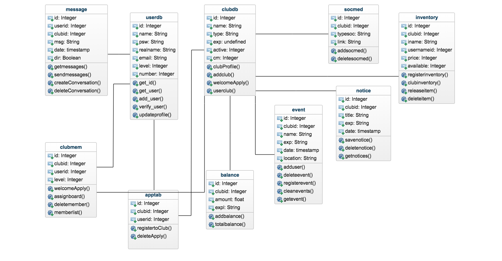

Developer Guide
===============

Database Design
---------------

This is our class diagram that includes all of the tables from the database along side with their major functions.
To clarify, the *level* column in the *userdb* indicates the basic user level.
On the other hand, the *level* column in the *clubmem* indicates the level of the member for the club.

======  ==============      ======  =====
Club Levels                 User Levels
----------------------      -------------
Level      Role             Level   Role
======  ==============      ======  =====
0       Member              0       User
1       Chairman            1       Admin
2       Vice Chairman
3       Secretary
4       Accountant
5       Clerk
======  ==============      ======  =====

Technologies
------------
**Database:** PostgreSQL

**Language:** Python 3.5.2

**GUI:** HTML5,CSS

We basically used *Bootstrap* and *W3-CSS Library* for our design. We adapted some of their methods to not spoil our theme harmony.
Moreover, we used some open source 3rd party css files for login method. Although Bootstrap has great features, we used
a toolkit named *Font Awesome* for some extra visuality like social media icons. We used some JS codes for making some animations
like in the *clubs* page.

Code
----
Our basic code structure has these components:
  * templates
  * static
  * server.py
  * admin.py
  * classes.py
  * club.py
  * event.py
  * home.py
  * message.py
  * user.py

To explain the common ones;

In **templates** folder, there are html templates that used in the application.

In **static** folder, there are static files such as images, logos, css and javascript codes.

In **server.py,** is the init python file that has main header and the main application configurations are setted
in the file. Also the initialize database method is in this file. It can be called as *<domain>/initdb/100/3*

  .. code-block:: python
      :caption: server.py - main function

      if __name__ == '__main__':
          VCAP_APP_PORT = os.getenv('VCAP_APP_PORT')
          if VCAP_APP_PORT is not None:
              port, debug = int(VCAP_APP_PORT), False
          else:
              port, debug = 5000, True
          VCAP_SERVICES = os.getenv('VCAP_SERVICES')
          if VCAP_SERVICES is not None:
              app.config['dsn'] = get_elephantsql_dsn(VCAP_SERVICES)
          else:
              app.config['dsn'] = """user='vagrant' password='vagrant'
                                     host='localhost' port=5432 dbname='itucsdb'"""

          REMEMBER_COOKIE_DURATION = timedelta(seconds = 10)
          app.store = UserList(os.path.join(os.path.dirname(__file__),app.config['dsn']))
          app.run(host='0.0.0.0', port=port, debug=debug)

.. toctree::

   turgut
   koray
   beste
